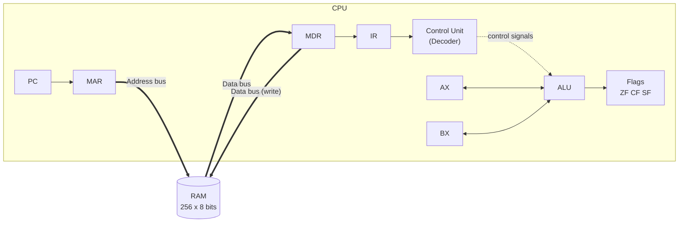

# 8-bit CPU Simulator (von Neumann) in ONLYOFFICE

Interactive simulator of an 8-bit von Neumann CPU and its main memory, built as an ONLYOFFICE Spreadsheet with JavaScript macros.
It shows the full instruction cycle (**Fetch → Decode → Execute → Store**) step by step, with live highlighting of registers and memory cells.

- **Course:** Computer Architecture (SIS131), Universidad Católica Boliviana "San Pablo", Santa Cruz
- **Instructor:** Ing. Paulo César Loayza Carrasco
- **Author:** Jussel Avila
- **Platform:** ONLYOFFICE Spreadsheet (.xlsx) + JavaScript macros
- **Project board:** <https://github.com/users/JusselAvila/projects/7>

## Project status

| Area | Status |
|------|--------|
| Repository & Kanban board | Done |
| Platform approval & modular structure | Done |
| RAM grid & converters | Done |
| Registers & flags | Done |
| Fetch / Decode / Execute / Store | Pending |
| Step & Run modes, logger | Pending |
| Demo program | Pending |


## 1. Architecture

The simulator follows the von Neumann model: one memory holds both instructions and data, and the CPU communicates with it through an address bus and a data bus.



In code, the CPU never touches the RAM array directly: every read/write goes through `Bus.read(address)` / `Bus.write(address, value)` (see `/src/bus.js`), which keeps memory access swappable for Parcial 2's system bus.

### Registers

| Register | Size | Purpose |
|----------|------|---------|
| `PC` | 8 bits | Address of the next instruction |
| `IR` | 8 bits | Opcode of the current instruction |
| `MAR` | 8 bits | Address being read or written in RAM |
| `MDR` | 8 bits | Data transferred to or from RAM |
| `AX` | 8 bits | Accumulator / general purpose |
| `BX` | 8 bits | General purpose (e.g. loop counter) |

### Status flags

| Flag | Meaning |
|------|---------|
| `ZF` | Set to 1 if the last result was 0 |
| `CF` | Set to 1 on unsigned carry (addition > 255) or borrow (subtraction < 0) |
| `SF` | Copy of bit 7 of the result (negative in two's complement) |

### Memory map (256 bytes, `00h`–`FFh`)

| Range | Segment | Use |
|-------|---------|-----|
| `00h`–`1Fh` | Code | Program instructions |
| `20h`–`7Fh` | Reserved | Free / future use |
| `80h`–`FFh` | Data | Variables and results |

## 2. Instruction Set Architecture (ISA)

<!-- TODO: keep this table identical to the ISA object in the code. -->

| Opcode | Mnemonic | Bytes | Flags |
|--------|----------|-------|-------|
| `00` | `HLT` | 1 | — |
| `01` / `02` | `MOV AX, imm` / `MOV BX, imm` | 2 | — |
| `03` / `04` | `MOV AX, BX` / `MOV BX, AX` | 1 | — |
| `05` / `06` | `LOAD AX, [dir]` / `LOAD BX, [dir]` | 2 | — |
| `07` / `08` | `STORE [dir], AX` / `STORE [dir], BX` | 2 | — |
| `10` / `11` | `ADD AX, imm` / `ADD BX, imm` | 2 | ZF CF SF |
| `12` / `13` | `ADD AX, BX` / `ADD BX, AX` | 1 | ZF CF SF |
| `14` / `15` | `SUB AX, imm` / `SUB BX, imm` | 2 | ZF CF SF |
| `16` / `17` | `SUB AX, BX` / `SUB BX, AX` | 1 | ZF CF SF |
| `18` / `19` | `INC AX` / `INC BX` | 1 | ZF SF |
| `1A` / `1B` | `DEC AX` / `DEC BX` | 1 | ZF SF |
| `1C` / `1D` | `CMP AX, imm` / `CMP BX, imm` | 2 | ZF CF SF |
| `1E` / `1F` | `CMP AX, BX` / `CMP BX, AX` | 1 | ZF CF SF |
| `20` / `21` | `AND AX, imm` / `AND AX, BX` | 2 / 1 | ZF SF (CF=0) |
| `22` / `23` | `OR AX, imm` / `OR AX, BX` | 2 / 1 | ZF SF (CF=0) |
| `24` / `25` | `XOR AX, imm` / `XOR AX, BX` | 2 / 1 | ZF SF (CF=0) |
| `26` / `27` | `NOT AX` / `NOT BX` | 1 | ZF SF (CF=0) |
| `30` | `JMP dir` | 2 | — |
| `31` | `JZ dir` | 2 | — |
| `32` | `JNZ dir` | 2 | — |

## 3. Instruction cycle

1. **Fetch:** `MAR ← PC`, `MDR ← RAM[MAR]`, `IR ← MDR`, `PC ← PC + 1`.
2. **Decode:** the Control Unit interprets `IR`. For 2-byte instructions the operand is read from memory and `PC` is incremented again.
3. **Execute:** the ALU operates and updates `ZF`, `CF`, `SF`, or the jump target is computed.
4. **Store:** the result is written to `AX`/`BX`, or to `RAM[MAR]` through `MDR`.

## 4. User manual

1. Open `simulator.xlsx` in ONLYOFFICE.
2. Open `View → Macros` and paste/load the simulator code.
3. Press `LOAD PROGRAM` to load the demo program.
4. Use `STEP` for one micro-operation at a time, or `RUN` for continuous execution (adjust the delay cell).
5. Use `PAUSE` to stop and `RESET` to restore registers, flags and log.

## 5. Demo program: 5 × 6 by successive additions

```asm
00: MOV AX, 0x00      ; accumulator = 0
02: MOV BX, 0x05      ; loop counter = 5
04: ADD AX, 0x06      ; loop: AX += 6
06: DEC BX            ; counter -= 1
07: JNZ 0x04          ; repeat while BX != 0
09: STORE [0x80], AX  ; save result
0B: HLT
```

Machine code: `01 00 02 05 10 06 1B 32 04 07 80 00`
Expected final state: `AX = 1Eh (30)`, `BX = 00h`, `ZF = 1`, `RAM[80h] = 1Eh`.

### Execution trace

<!-- TODO: fill with real simulator output, one row per micro-operation. -->

| Step | Phase | PC | IR | MAR | MDR | AX | BX | ZF | CF | SF |
|------|-------|----|----|-----|-----|----|----|----|----|----|
| 1 | | | | | | | | | | |

## 6. Project management

- Kanban board (GitHub Projects) with columns: `Backlog`, `To Do`, `In Progress`, `In Review / Testing`, `Done`.
- Every task is an issue with Objectives, Acceptance Criteria and Definition of Done.

### Commit convention

| Prefix | Use |
|--------|-----|
| `feat:` | New feature |
| `fix:` | Bug fix |
| `docs:` | Documentation |
| `refactor:` | Code change without behavior change |
| `chore:` | Repository maintenance |

Example: `feat: add ReadRAM/WriteRAM with boundary validation (#21)`

See [`/docs/architecture.md`](docs/architecture.md) for the module breakdown and the Bus abstraction used between the CPU and RAM.

## 7. Repository structure

```
/src
  utils.js    Shared formatting helpers (toHex, toBin, toDec)
  bus.js      System Bus abstraction (CPU never touches RAM array directly)
  ram.js      256-byte RAM, ReadRAM/WriteRAM, ClearRAM, display-mode logic
  cpu.js      Registers, flags, GetSegment, ResetCPU
  ui.js       All ONLYOFFICE sheet/cell interaction (registers, flags, RAM grid)
  alu.js      Arithmetic/logic operations (pending)
  decoder.js  Opcode decoding (pending)
  logger.js   Execution log buffer (WriteLog, ClearLog) - sheet panel added in Task 5.2  
  isa.js      Single source of truth for the ISA (opcode table, GetInstruction, IsValidOpcode)
  main.js     Instruction-cycle control unit (Fetch implemented; Decode/Execute/Store pending) + button wiring (pending)
/docs         Architecture notes, screenshots, platform approval
/program      Demo program (.asm and .hex)
/tests        Test plan and test cases
simulator.xlsx
README.md
```
