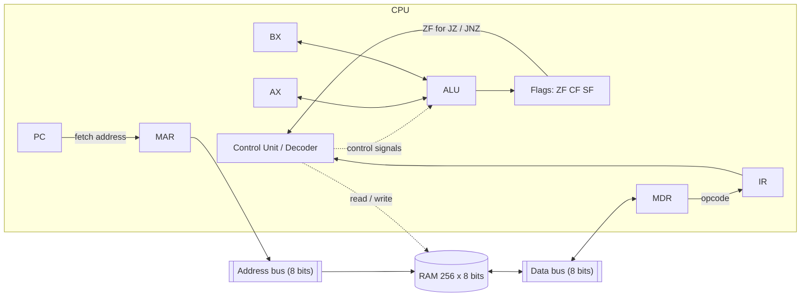

# 8-bit CPU Simulator (von Neumann) in ONLYOFFICE

Interactive simulator of an 8-bit von Neumann CPU and its main memory, built as an ONLYOFFICE Spreadsheet with JavaScript macros.
It shows the full instruction cycle (**Fetch → Decode → Execute → Store**) step by step, with live highlighting of registers and memory cells.

- **Course:** Computer Architecture (SIS131), Universidad Católica Boliviana "San Pablo", Santa Cruz
- **Instructor:** Ing. Paulo César Loayza Carrasco
- **Author:** Jussel Avila
- **Platform:** ONLYOFFICE Spreadsheet (.xlsx) + JavaScript macros
- **Project board:** <https://github.com/users/JusselAvila/projects/7>

## Project status

| Area | Status |
|------|--------|
| Repository & Kanban board | Done |
| Platform approval & modular structure | Done |
| RAM grid & converters | Done |
| Registers & flags | Done |
| Fetch / Decode / Execute / Store | Done |
| Step & Run modes, logger | Done |
| Demo program | Done |
| Edge-case test suite | Done |
| Documentation & defense | Done |


## 1. Architecture

The simulator follows the von Neumann model: a single 256-byte memory holds both the program and its data, and the CPU reaches it through one address bus and one data bus. Because instructions and data share the same path, the CPU works in a strict sequence: it first fetches the instruction from memory into `IR`, then decodes it, executes it in the ALU and finally stores the result, one micro-operation at a time.

- **Control Unit** (`main.js`, `decoder.js`): drives the Fetch → Decode → Execute → Store state machine and generates the control signals.
- **Registers**: `PC` (next instruction), `IR` (current opcode), `MAR`/`MDR` (memory interface), `AX`/`BX` (general purpose).
- **ALU** (`alu.js`): 8-bit arithmetic and logic, updates `ZF`, `CF` and `SF`.
- **Buses** (`bus.js`): `MAR` drives the address bus; `MDR` exchanges bytes with RAM over the data bus.
- **RAM** (`ram.js`): 256 × 8 bits, split into Code, Reserved and Data segments.



In code, the CPU never touches the RAM array directly: every read/write goes through `Bus.read(address)` / `Bus.write(address, value)` (see `/src/bus.js`), which keeps memory access swappable for Parcial 2's system bus.

### Registers

| Register | Size | Purpose |
|----------|------|---------|
| `PC` | 8 bits | Address of the next instruction |
| `IR` | 8 bits | Opcode of the current instruction |
| `MAR` | 8 bits | Address being read or written in RAM |
| `MDR` | 8 bits | Data transferred to or from RAM |
| `AX` | 8 bits | Accumulator / general purpose |
| `BX` | 8 bits | General purpose (e.g. loop counter) |

### Status flags

| Flag | Meaning |
|------|---------|
| `ZF` | Set to 1 if the last result was 0 |
| `CF` | Set to 1 on unsigned carry (addition > 255) or borrow (subtraction < 0) |
| `SF` | Copy of bit 7 of the result (negative in two's complement) |

### Memory map (256 bytes, `00h`–`FFh`)

| Range | Segment | Use |
|-------|---------|-----|
| `00h`–`1Fh` | Code | Program instructions |
| `20h`–`7Fh` | Reserved | Free / future use |
| `80h`–`FFh` | Data | Variables and results |

## 2. Instruction Set Architecture (ISA)

Defined in [`/src/isa.js`](src/isa.js), the single source of truth used by the decoder and the RAM mnemonic view. `imm` is an 8-bit immediate, `dir` an 8-bit memory address.

| Opcode | Mnemonic | Bytes | Flags |
|--------|----------|-------|-------|
| `00` | `HLT` | 1 | — |
| `01` / `02` | `MOV AX, imm` / `MOV BX, imm` | 2 | — |
| `03` / `04` | `MOV AX, BX` / `MOV BX, AX` | 1 | — |
| `05` / `06` | `LOAD AX, [dir]` / `LOAD BX, [dir]` | 2 | — |
| `07` / `08` | `STORE [dir], AX` / `STORE [dir], BX` | 2 | — |
| `10` / `11` | `ADD AX, imm` / `ADD BX, imm` | 2 | ZF CF SF |
| `12` / `13` | `ADD AX, BX` / `ADD BX, AX` | 1 | ZF CF SF |
| `14` / `15` | `SUB AX, imm` / `SUB BX, imm` | 2 | ZF CF SF |
| `16` / `17` | `SUB AX, BX` / `SUB BX, AX` | 1 | ZF CF SF |
| `18` / `19` | `INC AX` / `INC BX` | 1 | ZF SF |
| `1A` / `1B` | `DEC AX` / `DEC BX` | 1 | ZF SF |
| `1C` / `1D` | `CMP AX, imm` / `CMP BX, imm` | 2 | ZF CF SF |
| `1E` / `1F` | `CMP AX, BX` / `CMP BX, AX` | 1 | ZF CF SF |
| `20` / `21` | `AND AX, imm` / `AND AX, BX` | 2 / 1 | ZF SF (CF=0) |
| `22` / `23` | `OR AX, imm` / `OR AX, BX` | 2 / 1 | ZF SF (CF=0) |
| `24` / `25` | `XOR AX, imm` / `XOR AX, BX` | 2 / 1 | ZF SF (CF=0) |
| `26` / `27` | `NOT AX` / `NOT BX` | 1 | ZF SF (CF=0) |
| `30` | `JMP dir` | 2 | — |
| `31` | `JZ dir` | 2 | — |
| `32` | `JNZ dir` | 2 | — |

## 3. Instruction cycle

1. **Fetch:** `MAR ← PC`, `MDR ← RAM[MAR]`, `IR ← MDR`, `PC ← PC + 1`.
2. **Decode:** the Control Unit interprets `IR`. For 2-byte instructions the operand is read from memory and `PC` is incremented again.
3. **Execute:** the ALU operates and updates `ZF`, `CF`, `SF`, or the jump target is computed.
4. **Store:** the result is written to `AX`/`BX`, or to `RAM[MAR]` through `MDR`.

## 4. User manual

1. Open `simulator.xlsx` in ONLYOFFICE and set up the buttons once (see below).
2. Type the program as space-separated hex bytes into the source cell (`K25`) and press **LOAD PROGRAM**. If `K25` is empty, the built-in demo (multiplication by successive additions) is loaded.
3. Press **STEP** to execute one micro-operation, or **RUN** for continuous execution.
4. Press **PAUSE** to stop RUN without losing state; STEP or RUN continue from the same point.
5. Press **RESET** to clear registers, flags, phase indicator, step counter, highlights and log. RAM contents are preserved.

### Setting up the buttons

ONLYOFFICE can only assign macros to graphic objects, not to cells, so each button is a shape placed over its label cell.

1. Generate the macros from `/src`: `node tools/build-macros.js` (writes `dist/macros/*.js`).
2. Open **View → Macros**, create one macro per file below, name it as in the table and paste the whole file content.
3. Insert a shape (**Insert → Shape**) over each button cell, right-click it → **Assign Macro** and choose the matching macro.
4. Save the workbook as `.xlsx` so the macros and shapes are stored in the file.

| Button (cell) | Macro name | File |
|---------------|------------|------|
| STEP (`B21`) | `STEP` | `dist/macros/step.js` |
| RUN (`D21`) | `RUN` | `dist/macros/run.js` |
| PAUSE (`B22`) | `PAUSE` | `dist/macros/pause.js` |
| RESET (`D22`) | `RESET` | `dist/macros/reset.js` |
| LOAD PROGRAM (`B23`) | `LOAD_PROGRAM` | `dist/macros/load-program.js` |
| optional | `RUN_TO_END` | `dist/macros/run-to-end.js` |
| optional | `LOAD_DEMO` | `dist/macros/load-demo.js` |

Every macro contains the full simulator and ends with `SimulatorMain("<ACTION>")`. ONLYOFFICE runs each macro as an independent script, so JavaScript variables do not survive between clicks; the simulator state (registers, flags, RAM, phase, pending write-back, highlights, log and RUN status) is saved as JSON in cell `BH1` after every action and restored at the start of the next one (`src/state.js`). Do not edit `BH1`; the column can be hidden. After changing any file in `/src`, rebuild and paste the macros again.

### Control cells

| Cell | Content |
|------|---------|
| `C18` | Current phase (`FETCH`, `DECODE`, `EXECUTE`, `STORE`) |
| `C19` | Step counter (micro-operations executed) |
| `C20` | Current micro-operation (e.g. `MDR <- RAM[MAR]`) |
| `C24` | RUN delay in milliseconds (default 500 if empty or invalid) |
| `K25` | Program source (space-separated hex bytes) |
| `B28:Z43` | Log table (16 rows, scrolling) |
| `BH1` | Serialized simulator state (internal) |

### Step debugger and highlighting

Every STEP executes exactly one micro-operation. Before each micro-operation the previous highlight is cleared, then only the cells involved in that micro-operation are painted with the color of its phase, so two phases never appear at the same time. The phase indicator (`C18`/`C20`) always matches the painted cells.

| Phase | Color | Highlighted cells |
|-------|-------|-------------------|
| Fetch | Yellow | `PC`, `MAR`, `MDR`, `IR`, and the RAM cell at `PC` being read |
| Decode | Blue | `IR`, and for 2-byte instructions `MAR`, `MDR` and the operand cell in RAM |
| Execute | Green | `AX`, `BX`, `ZF`, `CF`, `SF` (ALU); `MAR`/`MDR` and the RAM cell for `LOAD`; `PC` and `ZF` for jumps |
| Store | Red | Destination register (`AX`, `BX` or `PC` for taken jumps), or the target RAM cell with `MAR`/`MDR` |

Jumps also go through Store: Execute evaluates the condition and Store writes the new `PC`. `CMP` and non-taken jumps show `no write-back`.

### RUN engine

RUN schedules one micro-operation per tick with `setTimeout`, so the spreadsheet stays responsive between micro-operations. The delay is read from `C24` on every tick, so changing it while running changes the speed immediately. RUN stops automatically on `HLT`, on an illegal opcode, or on a runtime error.

PAUSE and RESET are separate macro runs and cannot cancel the timer created by RUN directly. Instead, every tick reloads the saved state and stops when `isRunning` is false or when a newer RUN replaced its `runId`, so pressing RUN twice never starts two loops.

If the ONLYOFFICE macro sandbox does not provide `setTimeout`, `Run()` falls back to `RunBatch(500)`, which executes up to 500 micro-operations synchronously (enough for the demo program, 173 micro-operations) and stops on `HLT` or an illegal opcode. The `RUN_TO_END` macro runs this batch mode directly, for editors where timer callbacks do not update the sheet. In batch mode the delay cell is ignored and PAUSE has no effect.

Suggested speeds for verification: fast `50` ms, medium `500` ms, slow `1500` ms.

### Log format

Each micro-operation writes one row of the log table with the step number, the phase, the registers and flags after it, and the timestamped transfer:

| Step | Phase | PC | IR | MAR | MDR | AX | BX | Flags | Micro-Operation / Trace |
|------|-------|----|----|-----|-----|----|----|-------|-------------------------|
| 03 | FETCH | 00 | 01 | 00 | 01 | 00 | 00 | Z0 C0 S0 | `[22:52:47.512] IR <- MDR (0x01) -> IR=MOV AX, imm` |

Control messages (`[RUN] Started`, `[PAUSE] ...`, `[LOAD] ...`) only fill the last column. When the 16 rows are full, the oldest row is dropped and the rest shift up.

## 5. Demo program: 5 × 6 by successive additions

Source: [`/program/multiplication.asm`](program/multiplication.asm), machine code: [`/program/multiplication.hex`](program/multiplication.hex). The program uses a loop, a conditional branch, flag updates and a store to the Data Segment, so it goes through all four phases of the instruction cycle.

| Addr | Bytes | Assembly | Comment |
|------|-------|----------|---------|
| `00h` | `01 00` | `MOV AX, 0x00` | accumulator = 0 |
| `02h` | `02 05` | `MOV BX, 0x05` | loop counter = 5 |
| `04h` | `10 06` | `ADD AX, 0x06` | loop: AX += 6 |
| `06h` | `1B` | `DEC BX` | counter −= 1 (sets ZF) |
| `07h` | `32 04` | `JNZ 0x04` | repeat while BX ≠ 0 |
| `09h` | `07 80` | `STORE [0x80], AX` | save result |
| `0Bh` | `00` | `HLT` | stop |

Machine code: `01 00 02 05 10 06 1B 32 04 07 80 00`
Expected final state: `AX = 1Eh (30)`, `BX = 00h`, `ZF = 1`, `RAM[80h] = 1Eh`, CPU halted.

Load it with **LOAD PROGRAM** and `K25` empty (the demo is written into `K25` automatically), or paste the machine code into `K25`. No manual RAM editing is needed.

### Cycle analysis

Every instruction goes through Fetch (4 micro-operations: `MAR <- PC`, `MDR <- RAM[MAR]`, `IR <- MDR`, `PC <- PC + 1`). Two-byte instructions need 4 more in Decode to read the operand; Execute takes 1 (2 for `LOAD`); Store takes 1 for a register, 3 for a memory write (`MAR`, `MDR`, `RAM[MAR] <- MDR`), and `HLT` ends in Execute.

| Instruction | Fetch | Decode | Execute | Store | Micro-ops | Times executed | Total |
|-------------|-------|--------|---------|-------|-----------|----------------|-------|
| `MOV AX, 0x00` | 4 | 4 | 1 | 1 | 10 | 1 | 10 |
| `MOV BX, 0x05` | 4 | 4 | 1 | 1 | 10 | 1 | 10 |
| `ADD AX, 0x06` | 4 | 4 | 1 | 1 | 10 | 5 | 50 |
| `DEC BX` | 4 | 1 | 1 | 1 | 7 | 5 | 35 |
| `JNZ 0x04` | 4 | 4 | 1 | 1 | 10 | 5 | 50 |
| `STORE [0x80], AX` | 4 | 4 | 1 | 3 | 12 | 1 | 12 |
| `HLT` | 4 | 1 | 1 | — | 6 | 1 | 6 |
| **Total** | | | | | | **19 instructions** | **173 micro-operations** |

The loop body (`ADD`, `DEC`, `JNZ`) runs 5 times: `JNZ` is taken 4 times (`ZF = 0`, Store writes `PC = 04h`) and falls through on the fifth `DEC BX`, when `BX` becomes `00h` and `ZF = 1`.

### Instruction-by-instruction trace

Register values in hex after the last micro-operation of each instruction (from the simulator's step mode):

| # | Steps | Instruction | PC | IR | MAR | MDR | AX | BX | ZF | CF | SF |
|---|-------|-------------|----|----|-----|-----|----|----|----|----|----|
| 1 | 1–10 | `MOV AX, 0x00` | 02 | 01 | 01 | 00 | 00 | 00 | 0 | 0 | 0 |
| 2 | 11–20 | `MOV BX, 0x05` | 04 | 02 | 03 | 05 | 00 | 05 | 0 | 0 | 0 |
| 3 | 21–30 | `ADD AX, 0x06` | 06 | 10 | 05 | 06 | 06 | 05 | 0 | 0 | 0 |
| 4 | 31–37 | `DEC BX` | 07 | 1B | 06 | 1B | 06 | 04 | 0 | 0 | 0 |
| 5 | 38–47 | `JNZ 0x04` (taken) | 04 | 32 | 08 | 04 | 06 | 04 | 0 | 0 | 0 |
| 6 | 48–57 | `ADD AX, 0x06` | 06 | 10 | 05 | 06 | 0C | 04 | 0 | 0 | 0 |
| 7 | 58–64 | `DEC BX` | 07 | 1B | 06 | 1B | 0C | 03 | 0 | 0 | 0 |
| 8 | 65–74 | `JNZ 0x04` (taken) | 04 | 32 | 08 | 04 | 0C | 03 | 0 | 0 | 0 |
| 9 | 75–84 | `ADD AX, 0x06` | 06 | 10 | 05 | 06 | 12 | 03 | 0 | 0 | 0 |
| 10 | 85–91 | `DEC BX` | 07 | 1B | 06 | 1B | 12 | 02 | 0 | 0 | 0 |
| 11 | 92–101 | `JNZ 0x04` (taken) | 04 | 32 | 08 | 04 | 12 | 02 | 0 | 0 | 0 |
| 12 | 102–111 | `ADD AX, 0x06` | 06 | 10 | 05 | 06 | 18 | 02 | 0 | 0 | 0 |
| 13 | 112–118 | `DEC BX` | 07 | 1B | 06 | 1B | 18 | 01 | 0 | 0 | 0 |
| 14 | 119–128 | `JNZ 0x04` (taken) | 04 | 32 | 08 | 04 | 18 | 01 | 0 | 0 | 0 |
| 15 | 129–138 | `ADD AX, 0x06` | 06 | 10 | 05 | 06 | 1E | 01 | 0 | 0 | 0 |
| 16 | 139–145 | `DEC BX` | 07 | 1B | 06 | 1B | 1E | 00 | 1 | 0 | 0 |
| 17 | 146–155 | `JNZ 0x04` (not taken) | 09 | 32 | 08 | 04 | 1E | 00 | 1 | 0 | 0 |
| 18 | 156–167 | `STORE [0x80], AX` | 0B | 07 | 80 | 1E | 1E | 00 | 1 | 0 | 0 |
| 19 | 168–173 | `HLT` | 0C | 00 | 0B | 00 | 1E | 00 | 1 | 0 | 0 |

`RAM[80h] = 1Eh` after step 167. `PC = 0Ch` at the end because Fetch already incremented it past `HLT`.

### Micro-operation trace of the first instruction

First instruction (`MOV AX, 0x00`) traced in step mode, one row per micro-operation (values in hex, after the micro-operation):

| Step | Phase | Micro-operation | PC | IR | MAR | MDR | AX | BX | ZF | CF | SF |
|------|-------|-----------------|----|----|-----|-----|----|----|----|----|----|
| 1 | FETCH | `MAR <- PC` | 00 | 00 | 00 | 00 | 00 | 00 | 0 | 0 | 0 |
| 2 | FETCH | `MDR <- RAM[MAR]` | 00 | 00 | 00 | 01 | 00 | 00 | 0 | 0 | 0 |
| 3 | FETCH | `IR <- MDR` | 00 | 01 | 00 | 01 | 00 | 00 | 0 | 0 | 0 |
| 4 | FETCH | `PC <- PC + 1` | 01 | 01 | 00 | 01 | 00 | 00 | 0 | 0 | 0 |
| 5 | DECODE | decode opcode (operand needed) | 01 | 01 | 00 | 01 | 00 | 00 | 0 | 0 | 0 |
| 6 | DECODE | `MAR <- PC` (operand) | 01 | 01 | 01 | 01 | 00 | 00 | 0 | 0 | 0 |
| 7 | DECODE | `MDR <- RAM[MAR]` (operand) | 01 | 01 | 01 | 00 | 00 | 00 | 0 | 0 | 0 |
| 8 | DECODE | `PC <- PC + 1`, decoded `MOV AX, 0x00` | 02 | 01 | 01 | 00 | 00 | 00 | 0 | 0 | 0 |
| 9 | EXECUTE | `MOV AX` | 02 | 01 | 01 | 00 | 00 | 00 | 0 | 0 | 0 |
| 10 | STORE | `AX <- 0x00` | 02 | 01 | 01 | 00 | 00 | 00 | 0 | 0 | 0 |

Screenshots of the step-mode trace are in [`/docs/screenshots`](docs/screenshots).

### Variant with different operands

[`/program/multiplication-7x3.hex`](program/multiplication-7x3.hex) (`01 00 02 03 10 07 1B 32 04 07 80 00`) changes only the two immediates (loop count `03h`, addend `07h`). Paste it into `K25` and press LOAD PROGRAM to show that the data can be changed live: the result is `AX = RAM[80h] = 15h (21)` after 13 instructions.

## 6. Testing

The [test plan](tests/test-plan.md) covers ALU flag edge cases, memory boundaries and segment protection, jumps, `HLT`, illegal opcodes, RESET/LOAD, PAUSE/RUN and the demo program. Run the automated suite with:

```bash
node tests/run-tests.js
```

Input, expected and observed result of every case: [tests/test-results.md](tests/test-results.md).

## 7. Live defense

Demo script (10 minutes), live-modification scenarios and theory answers: [docs/defense.md](docs/defense.md).

## 8. Project management

- [Kanban board](https://github.com/users/JusselAvila/projects/7) (GitHub Projects) with columns: `Backlog`, `To Do`, `In Progress`, `In Review / Testing`, `Done`.
- Every task is an issue with Objectives, Acceptance Criteria and Definition of Done.

### Commit convention

| Prefix | Use |
|--------|-----|
| `feat:` | New feature |
| `fix:` | Bug fix |
| `docs:` | Documentation |
| `refactor:` | Code change without behavior change |
| `chore:` | Repository maintenance |

Example: `feat: add ReadRAM/WriteRAM with boundary validation (#21)`

See [`/docs/architecture.md`](docs/architecture.md) for the module breakdown and the Bus abstraction used between the CPU and RAM.

## 9. Repository structure

```
/src
  utils.js    Shared formatting helpers (toHex, toBin, toDec, pad)
  isa.js      Single source of truth for the ISA (opcode table, GetInstruction, IsValidOpcode)
  ram.js      256-byte RAM, ReadRAM/WriteRAM, ClearRAM, display-mode logic
  bus.js      System Bus abstraction (CPU never touches RAM array directly)
  cpu.js      Registers, flags, GetSegment, ResetCPU
  alu.js      Pure arithmetic/logic operations with ZF/CF/SF (ADD, SUB, INC, DEC, CMP, AND, OR, XOR, NOT)
  decoder.js  Pure opcode decoding (DecodeOpcode, BuildDecodedInstruction, Disassemble)
  logger.js   Timestamped execution log with 16-line scrolling panel (WriteLog, ClearLog)
  ui.js       All ONLYOFFICE sheet/cell interaction (registers, flags, RAM grid, highlights, phase indicator, log table, speed cell)
  state.js    Saves/restores the simulator state in cell BH1 between macro runs
  main.js     Instruction-cycle control unit, STEP/RUN/PAUSE/RESET actions, Program Loader, SimulatorMain entry point
/tools
  build-macros.js          Generates one self-contained button macro per action into /dist/macros
  sync-workbook-macros.py  Copies /dist/macros into simulator.xlsx (keeps the button assignments)
/dist/macros  Generated button macros to paste into ONLYOFFICE (do not edit by hand)
/docs         Architecture notes, defense script, screenshots, platform approval
/program      Demo program and 7 x 3 variant (.asm and .hex)
/tests
  test-plan.md     Test method, coverage and manual ONLYOFFICE checklist
  run-tests.js     Automated suite (node tests/run-tests.js)
  test-results.md  Generated input / expected / observed table
simulator.xlsx
README.md
```
